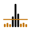

# About the project

Generated by `site/scripts/gen-docs.mjs` from the pages of the documentation site named under each heading below: do not edit this file. Change the page, and its Spanish twin beside it, then run `pnpm run docs` in `site/`.

## Releases

The current mikroscope release and its date, read at build from VERSION and CHANGELOG.md, what every release publishes, and where the full history is.

Source: <https://jmrp.io/docs/mikroscope/about/changelog/>

The current release of mikroscope is [1.4.0](https://github.com/jmrplens/mikroscope/releases/tag/v1.4.0), released on 2026-09-27. Both are
read at build from the repository's [`VERSION`](https://github.com/jmrplens/mikroscope/blob/main/VERSION) file and from the dated heading that
version has in [`CHANGELOG.md`](https://github.com/jmrplens/mikroscope/blob/main/CHANGELOG.md), and the site does not build when that heading is missing.
The version is compiled into both binaries and reported by `mikroscope version`, and the install
commands on every page carry it.

### Release history

- [`CHANGELOG.md`](https://github.com/jmrplens/mikroscope/blob/main/CHANGELOG.md) has one section
  per release, newest first, in the [Keep a Changelog](https://keepachangelog.com/en/1.1.0/) form.
  Its headings carry a date from 1.1.0 on.
- [GitHub Releases](https://github.com/jmrplens/mikroscope/releases) has each tag's notes, archives,
  image tars, checksums, signatures and SBOMs.
- [The releases feed](https://github.com/jmrplens/mikroscope/releases.atom) is the same list as
  Atom, for a feed reader.

Version numbers follow [Semantic Versioning 2.0.0](https://semver.org/spec/v2.0.0.html), as the
changelog states. The guides describe the current release; what changed between releases, and
when, is in the changelog.

Not every number has a release of its own:

| Version | Tag and release                | Its changes ship in | Changelog section |
| ------- | ------------------------------ | ------------------- | ----------------- |
| 1.0.5   | never tagged                   | v1.0.7              | yes               |
| 1.0.6   | tagged; its release run failed | v1.0.7              | yes               |
| 1.0.8   | never tagged                   | v1.0.9              | yes               |
| 1.0.10  | never tagged                   | v1.1.0              | none              |

### Release assets

A `v*` tag runs the GoReleaser configuration, [`.goreleaser.yaml`](https://github.com/jmrplens/mikroscope/blob/main/.goreleaser.yaml), which publishes:

- **CLI archives** for linux and freebsd on amd64, arm64 and arm (ARMv7), and for darwin and
  windows on amd64 and arm64: `.tar.gz`, and `.zip` on Windows, each carrying the
  MIT [`LICENSE`](https://github.com/jmrplens/mikroscope/blob/main/LICENSE) and [`README.md`](https://github.com/jmrplens/mikroscope/blob/main/README.md).
- **Agent archives** for linux on amd64, arm64, armv5 and armv7, for a host that wants the bare
  binary rather than an image.
- **Side-loadable agent image tars**, four of them: `mikroscope-agent-arm64.tar`,
  `mikroscope-agent-armv5.tar`, `mikroscope-agent-armv7.tar` and `mikroscope-agent-amd64.tar`.
  32-bit ARM is two because EN7562CT boards take only v5. `install --agent-tar` uploads one to the
  router.
- **The agent image in two registries**, `jmrplens/mikroscope-agent:1.4.0` on
  Docker Hub and `ghcr.io/jmrplens/mikroscope-agent:1.4.0` on GHCR (each also
  tagged `latest`), each one manifest over `linux/amd64`, `linux/arm64`, `linux/arm/v7` and
  `linux/arm/v5`, which `install --remote-image` makes the router pull. mikroscope sends the whole
  reference, registry host included (`registry-1.docker.io/…` for Docker Hub), so the global
  `/container/config registry-url` is neither needed nor written, and Docker Hub serves the image
  with no registry login. Up to 1.2.2 the host was left to `registry-url`, whose RouterOS default
  has not always been Docker Hub.
- **The collector image**, from 1.1.0 on, `jmrplens/mikroscope:1.4.0` on Docker
  Hub and `ghcr.io/jmrplens/mikroscope:1.4.0` on GHCR (each also tagged
  `latest`), over `linux/amd64` and `linux/arm64`, for the compose stacks
  under [`deploy/`](https://github.com/jmrplens/mikroscope/tree/main/deploy).
- **`checksums.txt`**, covering every archive and every agent image tar, a keyless cosign
  signature over it, and an SPDX SBOM per archive, signed in its own right. [Verifying the
  download](https://jmrp.io/docs/mikroscope/install/offline/#download-and-verify) has the commands.

Installing from a release needs no Go toolchain and no checkout. A checkout and Go 1.27 install an
agent built from your own tree instead: `make build` for the CLI, `make build-agent` for the agent,
which `install` and `image` also compile themselves. [Install
methods](https://jmrp.io/docs/mikroscope/install/routes/) compares the ways to get the agent onto a router and what
each one needs.

The `linux/arm/v5`, `linux/arm/v7` and `linux/amd64` builds are cross-built and checked in CI.
Which builds have run on hardware, and on which router, is on [Tested
on](https://jmrp.io/docs/mikroscope/about/status/).

### See also

- [Install methods](https://jmrp.io/docs/mikroscope/install/routes/): which of those files each install method takes,
  and how to verify it.
- [Install the CLI](https://jmrp.io/docs/mikroscope/install/cli/): the archive, `go install` or the install script, at
  the current release.
- [Tested on](https://jmrp.io/docs/mikroscope/about/status/): what the current release has run on, and what it has not.

## Lineage and licence

Which parts of mikroscope came from cs-routeros-bouncer, ghchronicle and go-routeros, what changed on the way, and the MIT licence they arrive under.

Source: <https://jmrp.io/docs/mikroscope/about/lineage/>

Parts of mikroscope started as code from cs-routeros-bouncer, ghchronicle and
go-routeros, all MIT-licensed. Below: which packages, what changed when they
arrived, and the licence. The attribution is also in the code, so it survives being read without this
site: in the package doc comment of [`internal/router/`](https://github.com/jmrplens/mikroscope/tree/main/internal/router), of the image
builder [`internal/image/`](https://github.com/jmrplens/mikroscope/tree/main/internal/image), of the chart [`internal/chart/`](https://github.com/jmrplens/mikroscope/tree/main/internal/chart) and
of the dashboard generator [`internal/dashboards/`](https://github.com/jmrplens/mikroscope/tree/main/internal/dashboards); in the API client's
own [`internal/rosapi/README.md`](https://github.com/jmrplens/mikroscope/blob/main/internal/rosapi/README.md) and [`internal/rosapi/LICENSE`](https://github.com/jmrplens/mikroscope/blob/main/internal/rosapi/LICENSE);
and in the header of [`.golangci.yml`](https://github.com/jmrplens/mikroscope/blob/main/.golangci.yml).

### Sampler origin

The sampler that proved this works is `cmd/perfmon` in
[cs-routeros-bouncer](https://github.com/jmrplens/cs-routeros-bouncer), built
for one benchmark and kept there as a developer instrument. The deployment steps, the
dockerless image builder, the deterministic chart and the vendored RouterOS
API client come from that repository, under its MIT licence.

### Imported packages

| mikroscope              | Taken from                                                            | What changed on the way                                                                                                                                                |
| ----------------------- | --------------------------------------------------------------------- | ---------------------------------------------------------------------------------------------------------------------------------------------------------------------- |
| `internal/router`       | cs-routeros-bouncer `cmd/perfmon`, the deployment steps after PR #123 | Extended with quoted ports in every `find`, the optional `--expose` firewall pair, mikroscope's own container settings, and a listing of every write before it happens |
| `internal/router` tests | cs-routeros-bouncer `cmd/perfmon`, the containment tests              | Adapted to mikroscope's option names and to two rules of its own: quoted ports, and the `--expose` pair as part of the plan                                            |
| `internal/image`        | cs-routeros-bouncer `cmd/perfmon/image.go`                            | Reworked for the agent's name, the ARM variant (an arm image declares its GOARM level: `v5` by default, `v7` with `--goarm 7`) and a build goreleaser can reuse                                                              |
| `internal/chart`        | cs-routeros-bouncer `cmd/perfmon/chart.go`                            | The original drew its palette from a docs theme; this one carries its own, validated for the light surface (adjacent-pair CVD ΔE 9.1, normal-vision 22.9)              |
| `internal/rosapi`       | cs-routeros-bouncer `internal/rosapi`, taken 2026-09-11               | The import path; since then tests and the package README only (1.0.1, 1.1.0), nothing in the shipped code                                                                                                                                                   |
| `.golangci.yml`         | ghchronicle and gitlab-mcp-server, themselves based on `maratori/golangci-lint-config` | The module path                                                                                                                                                        |

What PR #123 brought, and what mikroscope's installer keeps from it, is the
containment rule: every object created carries one exact comment tag, every
removal selects by that tag plus the object's identity (never by pattern), and
`uninstall` verifies by ownership counts before it reports success.
Nothing is written without being listed first.

The chart's output is deterministic: the same input always yields the same
bytes.

### Modelled designs

The model is [ghchronicle](https://github.com/jmrplens/ghchronicle), the other
telemetry project of mikroscope's maintainer, José Manuel Requena Plens, which
collects what GitHub reports about an account. `internal/dashboards` takes its
Grafana export shape from ghchronicle's
[`cmd/gen_dashboards`](https://github.com/jmrplens/ghchronicle/tree/main/cmd/gen_dashboards)
— "the shape, not the code", as its package comment says — and
`dashboards check` checks every panel on a real Grafana the way ghchronicle
does. Two more pieces are modelled on ghchronicle the same way, the shape and
not the code. The dashboards' named sections, the first open and every other one
collapsed, follow its
[`internal/dashboards/sections.go`](https://github.com/jmrplens/ghchronicle/blob/main/internal/dashboards/sections.go);
mikroscope's list is [`internal/dashboards/sections.go`](https://github.com/jmrplens/mikroscope/blob/main/internal/dashboards/sections.go). And the
end-to-end suite under [`test/e2e/`](https://github.com/jmrplens/mikroscope/tree/main/test/e2e) follows
[ghchronicle's `test/e2e/`](https://github.com/jmrplens/ghchronicle/tree/main/test/e2e),
which builds its binary and drives it against a fake GitHub with one test file
per sink.

### RouterOS API client

`internal/rosapi` has two generations of lineage. mikroscope's copy is
cs-routeros-bouncer's, with nothing modified in the shipped code. What changed since is
tests and the package's own `README.md`: 1.0.1 added one Windows-only skip to
`client_test.go`; 1.1.0 added two coverage tests (`dial_cover_test.go`,
`unknownreply_cover_test.go`), extended `proto_test.go`, and wrote that 1.0.1 skip into
the lineage note of `README.md`. mikroscope uses it
for the API tier's reads, for `mark --log-markers`, and for the `/tool fetch`
relay. The bouncer's copy is
itself a pruned vendoring of
[`github.com/go-routeros/routeros/v3`](https://github.com/go-routeros/routeros)
at **v3.0.1** (upstream commit of 2025-02-16), MIT, copyright 2016 André Luiz dos
Santos, whose `LICENSE` file stays in the package.

#### Why vendored

Upstream is effectively unmaintained: its last commit predates the copy by
eighteen months, and the pull requests and issues filed against the async mode
in mid-2026 (#31–#34) have had no maintainer response. No maintained
alternative exists: `swoga/go-routeros` is a copy that only receives
dependabot bumps for its GitHub Actions, and `jda/routeros-api-go` stopped in 2016. Vendoring keeps the code buildable and lets the copy fix and prune what it
uses.

#### Changes from upstream

These changes were made in cs-routeros-bouncer and arrive unchanged:

1. **The async/listen mode is removed**, with its tests and the async branch of
   `RunArgsContext`. Nothing in the bouncer called `Async()`, `Listen()` or the
   context-cancelling run variants. The sentence-kind constants moved to
   `reply.go`, which consumes them.
2. **The protocol reader and writer read and write directly**, instead of
   dispatching every call to a fresh goroutine with a channel and a copy
   buffer; only the removed async mode ever cancelled an in-flight read. At the
   bouncer's production scale (22k address-list entries fetched every cycle)
   that layer cost ~294 000 goroutine spawns, ~62 MB of garbage and ~76 % of
   all allocations per reconcile cycle. The rewrite was checked against pristine
   upstream with a differential test: the SHA-256 fingerprint over all 22 037
   parsed sentences identical, error shapes identical (`io.ErrUnexpectedEOF` on
   truncation, `*DeviceError` on `!trap`), and upstream's suite green under
   `go test -race`. `proto/reader_shape_test.go` pins that behaviour. Those four
   figures are cs-routeros-bouncer's own, measured on its own host against its own
   workload, not on a router and not by this project; `internal/rosapi/README.md`,
   where they come from, records no date and no host, so none can be given here.
3. **The pre-6.43 MD5 challenge login is removed.** That login exists only
   before RouterOS 6.43 (2018), and answering it means hashing the password with
   MD5. A router that sends a `ret` challenge gets `ErrLegacyLoginUnsupported`
   instead.
4. **The async and listen-mode tests are removed** with the mode; the pre-6.43
   login tests assert the rejection instead of the handshake. The rest of
   upstream's suite is kept and passing.

Compare against upstream's `v3.0.1` tag, not its master branch.

### Licence

mikroscope is MIT-licensed, copyright 2026 José Manuel Requena Plens, whom the
licence names by his handle, jmrplens; the full text is [`LICENSE`](https://github.com/jmrplens/mikroscope/blob/main/LICENSE)
at the root of the repository. The code taken from cs-routeros-bouncer arrives
under that repository's MIT licence, and `internal/rosapi` keeps go-routeros's
MIT `LICENSE` beside the code it covers. What each release changed,
corrections to this page included, is in [`CHANGELOG.md`](https://github.com/jmrplens/mikroscope/blob/main/CHANGELOG.md).

### See also

- [Installer safeguards](https://jmrp.io/docs/mikroscope/security/installer/): the containment rules the deployment
  code inherited, as they stand now.
- [RouterOS API tier](https://jmrp.io/docs/mikroscope/sinks/api-tier/): what the vendored client reads.
- [Record, mark and plot](https://jmrp.io/docs/mikroscope/record/): the deterministic chart `internal/chart` draws.
- [Tested on](https://jmrp.io/docs/mikroscope/about/status/): what works today, and on what it has run.
- [Releases](https://jmrp.io/docs/mikroscope/about/changelog/): the current release, what it publishes, and where the
  history of every release, this page's corrections among them, is kept.

## Logo and brand

Nine sample bars and the line of their own mean, why none of it is drawn at partial opacity, and the contrast each tone measures against its page.

Source: <https://jmrp.io/docs/mikroscope/about/brand/>

The mikroscope mark is nine sample bars and the line of their own mean, drawn in
two solid tones per theme. Below: what it says, how it is generated, and the
contrast of every tone against the background it is drawn on, with the cost of
that choice beside it.



### Concept

The mark is geometry, not a drawing: nine sample bars whose envelope is a
burst, crossed by the flat line of their own mean. That is the whole claim of
the project in one shape: a one-second average reports the line, and
sub-second sampling is what resolves the spike standing over it.

The burst is asymmetric the way a real one is: three quiet samples, a fast
rise, the peak, a slower fall, three quiet again. The peak sits in the middle
of an odd number of bars, so the mark balances on its own centre.

### Mean line

The generator draws the line at the arithmetic mean of the heights it was
given, not at a number chosen to look right, and a bar takes the loud tone
exactly when it stands above that mean. So the sentence the mark makes is one
the code enforces: three of the nine samples are above their own average, and
they are the three the eye goes to. `TestTheLineSitsAtTheMeanOfTheBars` fails
the build if the drawing and the arithmetic drift apart.

### Palette

Measured against the background each is drawn on, as WCAG 2.2 defines contrast:

| Theme | Background | Above the mean        | At or below it, and the line | Apart  |
| ----- | ---------- | --------------------- | ---------------------------- | ------ |
| Dark  | `#0e1316`  | `#fbbf24` **11.20:1** | `#c2740a` **5.16:1**         | 2.17:1 |
| Light | `#ffffff`  | `#633009` **10.73:1** | `#b45309` **5.02:1**         | 2.14:1 |

One palette per theme is not a refinement; it is the only way the mark is
legible in both. An amber light enough to read on the near-black page reads
1.67:1 on white (`#fbbf24`), and one dark enough for white disappears into the
dark page. On white, the sample standing above the
mean is the darker tone, so the mark reads the same way round in both themes.

`TestEveryToneClearsAAInItsOwnTheme` recomputes the ratios from the hex on
every run and fails the build if any tone reads under 4.5:1 on its own
background, or if a theme's two tones are less than 2.0:1 apart. A tone edited
without checking it fails the build rather than shipping.
`TestNothingInTheMarkDependsOnOpacity` guards the other half of the decision.

### No opacity

A quiet bar drawn as the loud colour at a low opacity reads well and fails.
Composited over the page, 0.28 of `#f59e0b` gives **1.73:1** on the dark
background and 0.42 of `#a16207` gives **1.80:1** on white, where AA asks
4.5:1. Reaching 4.5 by raising the alpha needs 0.68 in the dark theme and 0.96
in the light one, at which point a quiet bar is a loud bar and the one
distinction the mark exists to make is gone. So the split is two solid tones.

That costs punch. Solid against solid gives about **2.1:1** between the two
groups; drawing the quiet bar at 0.28 (0.42 on white) separates them by about
5:1 in the dark theme and 2.7:1 in the light one, at alphas that read 1.73:1 and
1.80:1 against their own page and so fail AA. What it buys is that nothing in
the mark composites against a background this repository does not control (a
README on GitHub, an `og:image` in a chat client, a favicon over browser
chrome), so every number in the table is the number the reader actually gets.

### Contrast rule

WCAG 1.4.11 asks **3:1** of a graphical object, and 1.4.3 exempts logotypes
from any minimum at all. 4.5:1 on every bar is a house rule stricter than the
standard, chosen by the project's maintainer, José Manuel Requena Plens, over
the smaller change of lifting the alphas to 3:1.

### Amber

Amber also means _threshold_ on this project's dashboards, where a panel turns
orange before it turns red. The two do not collide literally (the panels use
Grafana's own named colours and never these hexes), but a reader who has learnt
"amber means look at this" on a dashboard is being asked to read the same hue
as the project's own mark. That is the cost of the choice, made knowingly.

### Bar heights

The bar heights are not a real capture. A burst mikroscope measured peaked at
736 packets in one 20 ms sample against a median of 28, and 26× is a range no single square
renders: the quiet samples collapse to dots, or a log scale flattens the very
spike the mark exists to show. The heights in the mark are proportions of the
drawn height.

### Favicon

Nine bars at sixteen pixels is mush, so the favicon drops to five and keeps the
spike standing over the line, which is the part that carries the meaning.

The site's `favicon.svg` is the only icon with no ground of its own. It carries
both palettes and switches on the reader's own `prefers-color-scheme`, the
signal browser chrome itself follows, so it draws `#fbbf24`/`#c2740a` over a
dark chrome and `#633009`/`#b45309` over a light one. Every raster brings its
own `#0e1316` ground instead, because an `.ico` has no way to ask.

### Generated files

The mark lives as a generator, [`cmd/gen_brand/`](https://github.com/jmrplens/mikroscope/tree/main/cmd/gen_brand), rather than as a folder of
hand-drawn files, because changing the palette or the bar count is then one
edit instead of nine in each of a dozen files. It is a build-time tool and is
not one of the two released binaries. From the root of the repository:

```sh
go run ./cmd/gen_brand mark -out brand          # the mark and the favicon, per theme
go run ./cmd/gen_brand compose -out brand       # the banner, the social image and the og:image
go run ./cmd/gen_brand icons -out site/public   # the favicon, the touch icons and the web app manifest
```

`mark` is pure text. `compose` reads the three `bg-*.png` backgrounds from the
directory it writes to and shells out to `rsvg-convert` for the PNGs that ship.
`icons` shells out to `rsvg-convert` and to ImageMagick for the `.ico`, and is
the only one that writes outside [`brand/`](https://github.com/jmrplens/mikroscope/tree/main/brand). Every coordinate is written with two
decimals, rounded half to even, so the files are meant to reproduce byte for
byte on any machine; `TestMarkIsByteForByteReproducible` checks that two runs on
the same host give the same four mark and favicon files.

| File                                                   | Where          | Subcommand | What it is                                                                                            |
| ------------------------------------------------------ | -------------- | ---------- | ----------------------------------------------------------------------------------------------------- |
| `mark-dark.svg`, `mark-light.svg`                      | `brand/`       | `mark`     | The mark, one per theme                                                                               |
| `favicon-dark.svg`, `favicon-light.svg`                | `brand/`       | `mark`     | The five-bar variant, one per theme                                                                   |
| `mark-inline.svg`                                      | `brand/`       | `mark`     | The mark for a page that inlines it: the loud tone is `currentColor`, the quiet one `--ms-mark-quiet` |
| `favicon-inline.svg`                                   | `brand/`       | `mark`     | The favicon for a page that inlines it, the inline twin of `favicon.svg`                              |
| `banner.svg` and `.png`                                | `brand/`       | `compose`  | 1280×320, for the README                                                                              |
| `social.svg` and `.png`                                | `brand/`       | `compose`  | 1280×640, the repository social preview                                                               |
| `og.svg` and `.png`                                    | `brand/`       | `compose`  | 1200×630, the documentation `og:image`                                                                |
| `background.png`                                       | `brand/`       | none       | The generated field the three compositions crop from                                                  |
| `bg-banner.png`, `bg-social.png`, `bg-og.png`          | `brand/`       | none       | Those crops, which `compose` reads                                                                    |
| `favicon.svg`                                          | `site/public/` | `icons`    | Both palettes, switching on `prefers-color-scheme`                                                    |
| `site.webmanifest`                                     | `site/public/` | `icons`    | The web app manifest: names the 192, 512 and maskable rasters, with relative URLs                     |
| `favicon.ico`                                          | `site/public/` | `icons`    | Three drawings, at 16, 32 and 48 px, rather than one scaled three ways                                |
| `apple-touch-icon.png`, `icon-192.png`, `icon-512.png` | `site/public/` | `icons`    | 180, 192 and 512 px, each drawn at its own size                                                       |
| `icon-maskable-512.png`                                | `site/public/` | `icons`    | Inset further, to sit inside the circle 80 % of the icon across that a launcher may crop to           |

Every page's head links `favicon.svg`, `favicon.ico`, `apple-touch-icon.png` and `site.webmanifest`.
The `.ico` link says `sizes="32x32"`, which keeps Chromium on the SVG alone: headless Chromium 153
requested only `favicon.svg`. The manifest names `icon-192.png`, `icon-512.png` and
`icon-maskable-512.png` by URLs relative to itself, and leaves out `favicon.svg`, the one icon with
no ground of its own, since whatever lands on a home screen brings its own. It carries no `id`,
which is resolved against the origin of `start_url` rather than against the manifest: Chromium 153
resolved `./` to the root of the origin, here `https://jmrplens.github.io/`, the address the host's
own hub already claims with a manifest of its own, and an `id` that stays inside this site has to
spell out `/mikroscope/`, the base path nothing else in the manifest names. Left out, it defaults to
`start_url`, which Chromium resolves to `/mikroscope/`, the `id` it recommends.

One `theme-color` tag gives the colour of the header on screen, `#151c20` dark and `#fafbfb` light.
It follows the site's theme, not the system's scheme: it is served with the dark header, the theme a
page without JavaScript keeps whatever the system says, and a script in the head moves it to the
light one whenever the page turns light, from the system's scheme, the theme select, a stored choice
or the phone's toggle. Chrome reads the tag; Safari 26, by public reports and not tried here,
ignores it and takes the colour of the fixed header. In headless Chromium and WebKit, in both
schemes, after a pick, after a stored pick and a reload, after the phone's toggle and with
JavaScript off, the tag held the header's colour every time; the pair of tags split by
`prefers-color-scheme` it replaced held the other theme's colour after each pick, and on a light
system without JavaScript. Whether a phone's Chrome repaints its toolbar the moment the tag changes
was not tried on a device.

`TestTheCommittedWebFilesMatchTheGenerator` compares `favicon.svg` and `site.webmanifest` in
`site/public/` with what the generator writes now, so an edit that is not regenerated fails
`make test`; the PNGs depend on the installed converters and are not compared. Not tested: a real
phone, an install to a home screen, and how a launcher actually crops the maskable icon.

The mark in this site's header is `favicon-inline.svg`, the five-bar drawing, painted by the
site's own palette; `mark-inline.svg` fills the hero slot. Either way the drawing in the chrome is
the drawing in `brand/`.

### Background

Not written by the generator: `background.png` was generated once with
inference.sh (`openai/gpt-image-2`, 1536×1024, `quality: high`, $0.16) and is
kept as a raster. Everything drawn over it is vector, so the type stays crisp
at whatever size the raster is produced. The prompt asked for a near-black
field of faint vertical sample bars growing denser and warmer toward the right,
and for the left third to stay empty, which is where the mark and the type
sit, so the composition never fights its own background.

The three crops keep the whole left-to-right gradient rather than taking a
window out of the middle of it:

```sh
magick background.png -resize 1280x -gravity center -crop 1280x320+0+0 +repage bg-banner.png
magick background.png -resize 1280x -gravity center -crop 1280x640+0+0 +repage bg-social.png
magick background.png -resize 1200x -gravity center -crop 1200x630+0+0 +repage bg-og.png
```

The compositions are light on dark throughout, so they take the dark theme's
two tones and need no theme pair. Measured over the field's own darkest ground
(`#020608`, sampled from the left edge), the heading `#f6f3ee` reads 18.38:1,
the tagline `#cfc6b8` 12.04:1, and the mark's two tones 12.19:1 and 5.62:1:
higher than on the page, the field being darker than it. The tagline is "Sub-second
kernel telemetry from inside the router".

### Social preview

Manual: Settings, then Social preview, then upload `social.png`. GitHub offers
no API for it.

### See also

- [Dashboards](https://jmrp.io/docs/mikroscope/dashboards/): where amber means a threshold.
- [The landing page](https://jmrp.io/docs/mikroscope/): the claim the mark draws, in words.
- [Lineage and licence](https://jmrp.io/docs/mikroscope/about/lineage/): where the rest of the code came from.
